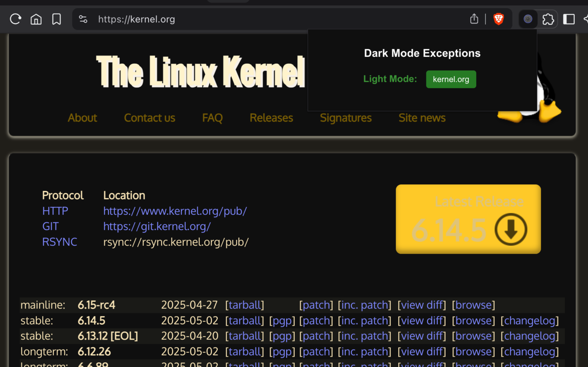
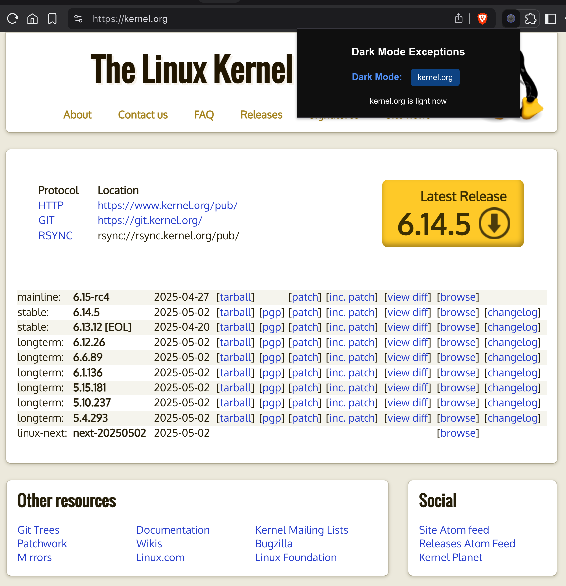
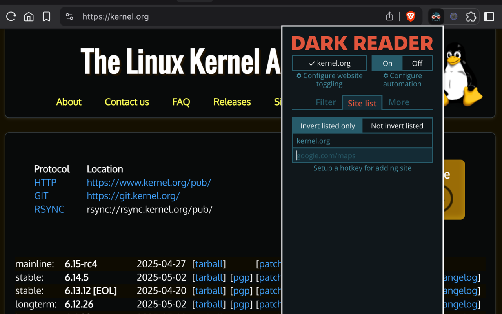

# Dark Mode Exceptions

**Dark Mode Exceptions** is a simple Chrome extension that lets you control which websites use dark mode. It works with Chrome's built-in "Auto Dark Mode for Web Contents" feature, allowing you to:

- Exclude websites from Chrome's dark mode in one click.
- Keep dark mode on most sites. View others in their original light design.
- Apply site-specific dark mode settings. Light mode won't interfere with site design.
- Use extensions like [Dark Reader](https://darkreader.org/) on excluded sites for better (or different) dark mode.
- Toggle between modes instantly.

---

## Why Use This Extension?

Chrome's built-in dark mode often produces inconsistent results across different websites. Dark Mode Exceptions gives you control over which sites use dark mode, ensuring the best viewing experience for each website you visit.

---

## Screenshots

---

## How It Works

1. **Enable Chrome's Auto Dark Mode:**
   - Go to `chrome://flags/#enable-force-dark`
   - Set to `Enabled with Selective inversion of non-image elements`
   - Restart Chrome

2. **Install Extension:**
   - Download/clone repository
   - Go to `chrome://extensions/`
   - Enable **Developer mode**
   - Click **Load unpacked** and select extension folder

3. **Exclude a Domain:**
   - Visit website
   - Click extension icon
   - Toggle domain
   - Site reloads in light theme

4. **(Optional) Use with Dark Reader:**
   - Install [Dark Reader](https://chrome.google.com/webstore/detail/dark-reader/eimadpbcbfnmbkopoojfekhnkhdbieeh)
   - Exclude site using this extension
   - Apply Dark Reader for better dark mode

## Technical Details

- Uses Chrome's `chrome.storage.sync` to remember your excluded domains.
- Injects a small CSS snippet to force light mode on excluded sites.
- No tracking, no ads, open source.

----

## Contributing

Pull requests and suggestions are welcome! If you find a bug or have an idea, open an issue or PR.

## License

Apache 2.0

## Privacy

This extension does not collect any user data as defined in the categories above. It only stores a user-specified list of website domains in chrome.storage.sync to toggle dark/light mode, and accesses the current tab's hostname to apply these settings. No personal data, web history, or user activity is collected.
